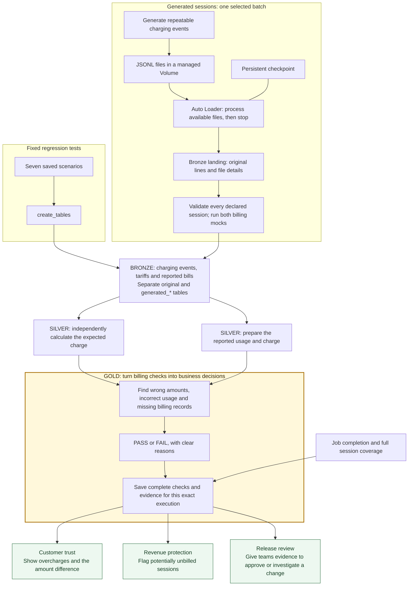

# ChargeAssert

**ChargeAssert helps EV charging teams catch billing errors before a software release overcharges customers or leaves completed sessions unbilled.**

A working MVP built with synthetic charging data, Databricks, Delta Lake, Python and SQL. It turns charging events and billing records into a clear PASS or FAIL, with the evidence needed to explain the result.

[Business value](#why-it-matters) · [Architecture](#architecture) · [Run the demo](#run-the-billing-demo) · [Project status](#current-status-and-next-steps)

## Why it matters

A charging session can finish successfully while its bill is wrong. A release might calculate the wrong amount or fail to produce a billing record at all. A successful data job alone does not prove that billing is correct.

ChargeAssert is designed to help teams answer three questions before a release:

| Business question | What ChargeAssert provides |
| --- | --- |
| Could customers be overcharged? | A comparison between the reported amount and an independently calculated charge. |
| Could completed sessions go unbilled? | A check that each completed test session has exactly one final billing record. |
| Can we explain a failed check? | Expected and actual values, the difference, source evidence and saved results for that job execution. |

Engineering teams can use the evidence to investigate a change. Billing teams can understand the financial difference without reading the pipeline code. The longer-term goal is to make these checks part of the release approval process.

### A concrete example

The amount demo uses a session that delivers **12.5 kWh at EUR 0.45 per kWh**. Its expected charge is **EUR 5.63**, rounded once at the session total, excluding VAT.

| Billing behavior | Expected amount | Reported amount | Difference | Result |
| --- | ---: | ---: | ---: | --- |
| Healthy baseline | EUR 5.63 | EUR 5.63 | EUR 0.00 | PASS |
| Candidate with a deliberate billing error | EUR 5.63 | EUR 6.50 | +EUR 0.87 | FAIL |
| Corrected candidate | EUR 5.63 | EUR 5.63 | EUR 0.00 | PASS |

A separate missing-record scenario checks what happens when a completed session produces no final billing record. The expected charge remains visible, and the check fails instead of treating the missing record as a zero charge.

These are controlled test cases. They show how a defect is detected; they are not measurements of actual customer charges, revenue loss or savings.

## How it works

1. **Keep the inputs.** Store the charging events, tariffs and reported billing records so a result can be traced back to its source.
2. **Calculate what should have been billed.** Use session meter readings and the applicable tariff to calculate the expected charge in SQL.
3. **Check both billing versions.** Compare the baseline and candidate records against that independent expectation.
4. **Save the decision and its evidence.** Record each rule's result and retain a separate snapshot for every completed job execution.

The **baseline** represents healthy billing behavior; the **candidate** represents the change under test. Today they are Python mocks or saved responses, rather than real software release builds. The SQL calculation is separate from the mock billing code: simply comparing two versions could miss an error shared by both.

Charging events use an OCPP-shaped format, and billing records use an OCPI-shaped format. A **CDR**, or charge detail record, is the final record describing a session's usage and charge.

## Architecture

Databricks runs the jobs. Delta tables hold the data, and Unity Catalog organizes it into Bronze, Silver and Gold schemas. There are two billing paths: the original fixed scenarios and a new path that checks a selected batch of generated sessions. They use separate tables.



**Generated sessions now have a path through Gold:** run `evaluate_generated_batch` after ingestion. It validates one complete batch and writes its own `generated_*` tables. The original `create_tables` job still checks only its seven fixed scenarios. A healthy two-session Gold result has been confirmed in Databricks. Deliberate-error and repeat-run checks are still pending.

**Gold provides the business evidence:** billing teams can see how much a reported charge differs from the expected amount, operations teams can find completed sessions with missing billing records, and release owners can review a PASS or FAIL with its supporting evidence. These outputs support human release reviews today; automated GitHub release checks are planned.

| Layer | Purpose | Main records |
| --- | --- | --- |
| **Bronze** | Keep the original evidence and the history of job attempts. | Charging events, tariffs, billing records, test inputs and execution status. The separate landing table also keeps source filenames, timestamps and record hashes. |
| **Silver** | Turn that evidence into records that can be compared. | Session start/end and energy, tariff history, independently expected charges and normalized reported charges. |
| **Gold** | Help teams catch customer overcharges, find potentially unbilled sessions and make informed release decisions. | Amount differences, missing-record checks, PASS/FAIL verdicts and saved evidence for each execution. |

The [table guide](docs/01-tables.md) explains each table's purpose. The [runbook](docs/02-runbook.md) covers the full data model, table rules and job dependencies.

### What makes a result trustworthy

- **Independent calculation:** both billing versions are checked against the expected charge, using decimal arithmetic and an explicit rounding rule.
- **Complete checks:** each scenario needs seven checks for each billing version: a usable expected charge, final-record count, energy, duration, currency, tariff and amount.
- **Traceable evidence:** raw payloads, hashes and expected-versus-actual values help explain a failure.
- **Separate execution history:** saved results belong to an exact job attempt. A failed or incomplete attempt cannot borrow an earlier PASS.

`release_verdict` shows the current fixed-scenario results; `execution_verdict` and `job_execution` identify an exact attempt. Generated batches have the same separation in `generated_release_verdict`, `generated_execution_verdict` and `generated_job_execution`. Always use the matching execution record and saved snapshot.

## Run the billing demo

### Requirements

- A Databricks workspace with Unity Catalog, a SQL warehouse and serverless notebook/job compute.
- Databricks CLI **0.295.0 or newer**, authenticated to that workspace.
- Permission to create the bundle's schemas, managed Volume, tables and jobs, and to use the compute.

The defaults in [databricks.yml](databricks.yml) use the `workspace` catalog and look up a warehouse named `Serverless Starter Warehouse`. Adjust the configuration if your workspace differs. The default schemas are `chargeassert_dev_bronze`, `chargeassert_dev_silver` and `chargeassert_dev_gold`.

### Deploy and run

From your local repository or Databricks Git folder, run these commands in order. Continue only after the previous command succeeds.

```bash
git switch dev
git pull --ff-only origin dev
databricks bundle validate -t dev
databricks bundle deploy -t dev
databricks bundle run -t dev create_tables
```

Despite its name, `create_tables` runs the full billing demo: it prepares the tables, loads the fixed inputs, generates the mock responses, runs the checks and saves the results. Pulling Git changes alone does not update the deployed job; deploy before running changed code.

The job runs **seven fixed scenarios**, with **14 checks per scenario** and **98 check results** in a complete execution. They cover a healthy case, saved wrong-amount/corrected responses, computed wrong-amount/corrected responses and missing-record/corrected responses.

**A successful job can contain financial FAIL results.** The bad scenarios are deliberately wrong. Job success means the processing and evidence capture completed; the financial verdict says whether a scenario passed its billing checks.

### Check the result

In Databricks SQL Editor, find the execution matching the job run you just started:

```sql
SELECT execution_id, started_at, status, reason
FROM workspace.chargeassert_dev_bronze.job_execution
ORDER BY started_at DESC
LIMIT 20;
```

Use that exact `execution_id` with [sql/12_check_execution.sql](sql/12_check_execution.sql). The [verification instructions](docs/02-runbook.md#check-the-requested-execution) give all parameter values and expected outcomes.

For the amount mock pair, expect:

| Scenario | Baseline | Candidate | Overall | Passed / failed checks |
| --- | --- | --- | --- | --- |
| `mock-amount-bad-v1` | PASS | FAIL | FAIL | 13 / 1 |
| `mock-amount-fixed-v1` | PASS | PASS | PASS | 14 / 0 |

Also confirm that the Databricks job itself finished successfully. The verification query returns `BLOCKED` for a missing, failed or incomplete execution instead of using a previous result. After a failed attempt, start a new complete run; repair runs are not supported by the current execution tracking.

## Run the file ingestion demo

After deploying the bundle, publish the first sample file and ingest it:

```bash
databricks bundle run -t dev publish_ingestion_demo --params batch=batch_001
databricks bundle run -t dev ingest_ocpp_files
```

Check the landed records in Databricks SQL Editor:

```sql
SELECT source_file_name, COUNT(*) AS landed_rows
FROM workspace.chargeassert_dev_bronze.ocpp_events_landing
WHERE source_file_name IN ('batch_001.jsonl', 'batch_002.jsonl')
GROUP BY source_file_name
ORDER BY source_file_name;
```

Run ingestion again, publish the second file, then ingest twice more. Check the row counts after each ingestion run.

```bash
databricks bundle run -t dev ingest_ocpp_files
databricks bundle run -t dev publish_ingestion_demo --params batch=batch_002
databricks bundle run -t dev ingest_ocpp_files
databricks bundle run -t dev ingest_ocpp_files
```

On the first demonstration, rows from these two sample files should follow **3 → 3 → 6 → 6**. The query excludes files created by the session generator. The checkpoint remembers which files were processed. Landing keeps repeated events from different files. The generated evaluator can remove identical copies after validating the selected batch.

Keep the published files and checkpoint unchanged. Repeating the whole demonstration after both files have landed leaves six rows. These jobs run on demand and stop when finished; no continuous service or schedule is configured.

See the [ingestion runbook](docs/02-runbook.md#incremental-ocpp-file-ingestion) and [verification queries](sql/13_check_ocpp_ingestion.sql) for source metadata, hash and repeat-run checks.

## Generate sessions and check their bills

After deployment, use a fresh batch name. These commands generate two sessions, ingest their six events, then check both billing mocks against the independent SQL calculation:

```bash
databricks bundle run -t dev combined_ingestion --params batch_id=sessions-repaired-001,session_count=2,seed=42
databricks bundle run -t dev evaluate_generated_batch --params batch_id=sessions-repaired-001,candidate_mode=healthy
```

Wait for each command to finish:

- **`combined_ingestion` creates and loads the sessions.** It generates two simulated sessions, then uses Auto Loader to load their six events into Bronze. `seed=42` makes the data repeatable.
- **`evaluate_generated_batch` checks the bills.** With `candidate_mode=healthy`, it calculates the expected charges, compares both simulated billing versions and saves the results in Gold. Expect **28 PASS checks**.

**Test whether bad billing is caught.** Use the same sessions, but add EUR 0.87 to each candidate bill:

```bash
databricks bundle run -t dev evaluate_generated_batch --params batch_id=sessions-repaired-001,candidate_mode=amount_error
```

Expect **26 PASS and 2 FAIL checks**: one incorrect charge caught per session. Baseline stays PASS; candidate and overall become FAIL. The job itself should succeed because it detected and saved the errors. Running `candidate_mode=healthy` again should give 28 PASS checks under a new execution ID.

Each command runs once and stops. Nothing runs continuously.

The evaluator prints its `execution_id`. Use it with [the generated-execution check](sql/15_check_generated_billing.sql). The [generated billing runbook](docs/02-runbook.md#evaluate-generated-batches-through-gold) explains the new tables, expected counts and failed-attempt checks.

The generator writes charging events only. Python billing mocks create complete baseline and candidate CDRs later; Silver SQL calculates the expectation separately. Generated evidence uses 13 dedicated tables, keeping it separate from the original demo. Both paths together use **26 tables and six manually started jobs**.

**Keep old files and results.** An earlier version mixed incomplete billing and tariff records into generated files. The evaluator rejects those files. Use a fresh batch name with the repaired event-only generator; do not overwrite files, delete landed evidence or reset the checkpoint. These remain synthetic mock bills, not real software release responses.

## Local tests

From the repository root, run:

```bash
python -B -m unittest discover -s tests -q
```

The tests cover billing behavior, assertions, verdict rules, execution tracking, session generation, file ingestion, complete generated-session coverage and saved-result consistency. They use local substitutes for parts of Databricks and Spark; workspace runs are still needed to verify the deployed pipeline.

## Current status and next steps

This is an independent public portfolio project and a working MVP using small synthetic cases. The current pricing model is a flat energy rate. It does not process real payments or yet test real baseline/candidate release builds.

**Verified in Databricks:** the original healthy billing checks, wrong-amount FAIL → corrected PASS examples, and a completed execution with seven saved scenario snapshots. A generated two-session Gold result also shows 28 checks and PASS for baseline, candidate and overall; see the [recorded result](docs/02-runbook.md#confirmed-generated-gold-result).

**Still to verify in Databricks:** the generated job completion record, deliberate billing errors followed by a healthy rerun, unchanged counts on repeat ingestion, missing-record snapshots, and recovery after an interrupted run.

The next milestones are:

1. **Finish the generated-session checks:** confirm the job completed, then test the deliberate amount error, stable reruns and failed-attempt blocking in Databricks.
2. **Handle broader incoming data:** add a place to review rejected records, more input formats, late-event rules and tested recovery/backfill procedures.
3. **Broaden the billing scenarios:** add duplicate records, wrong energy, wrong tariffs and retry failures.
4. **Test real releases:** replace mocks with external release replay and add GitHub checks tied to the exact Databricks execution.
5. **Measure the pipeline:** publish throughput, runtime and cost results from repeatable workloads.

The [remaining-work reference](docs/02-runbook.md#remaining-mvp-work) tracks the detailed gaps and acceptance checks.

## Repository guide

| Location | What it contains |
| --- | --- |
| [docs/OVERVIEW.pdf](docs/OVERVIEW.pdf) | Original MVP brief: the business problem, proposed architecture, target scenarios and project scope. |
| [docs/01-tables.md](docs/01-tables.md) | Short guide to the tables and their business purpose. |
| [docs/02-runbook.md](docs/02-runbook.md) | Detailed table rules, setup, verification and remaining work. |
| [databricks.yml](databricks.yml) | Bundle configuration and the development target. |
| [resources/](resources/) | Schemas, managed Volume and job definitions. |
| [sql/](sql/) | Original table definitions and checks; [sql/generated/](sql/generated/) holds the generated-batch transformations. |
| [notebooks/](notebooks/) | Session generation, mock billing, execution tracking and file ingestion code. |
| [data/ingestion_demo/](data/ingestion_demo/) | The two synthetic input files for the ingestion demo. |
| [tests/](tests/) | Local automated checks. |

Start with the [MVP brief](docs/OVERVIEW.pdf) for the original plan, the [table guide](docs/01-tables.md) for an overview, and the [runbook](docs/02-runbook.md) for implementation details. The PDF describes the target scope; it is not a claim that every planned feature is complete.
