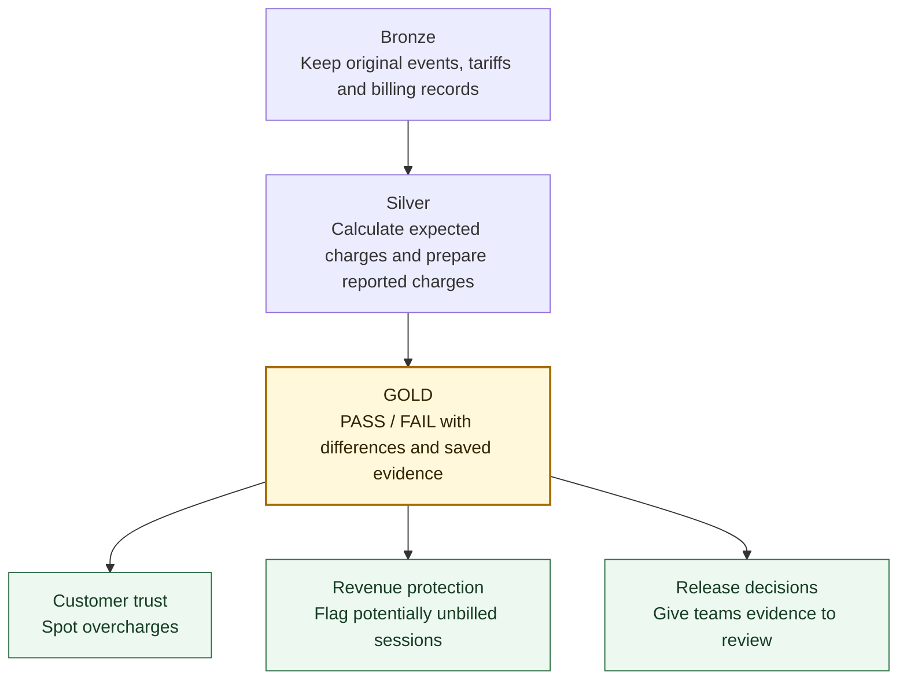

# ChargeAssert

**Catch EV charging billing errors before a software release overcharges customers or leaves sessions unbilled.**

ChargeAssert checks what a charging session should cost against what the billing system reports, then produces a PASS or FAIL with evidence.

**Built with:** Databricks · Python · SQL · Delta Lake · Auto Loader · Unity Catalog

## A concrete result

A test session delivers **12.5 kWh at EUR 0.45/kWh**: **EUR 5.63** after rounding, excluding VAT.

| Mock billing version | Reported charge | Result |
| --- | ---: | --- |
| Faulty candidate | EUR 6.50 | **FAIL** — EUR 0.87 too high |
| Corrected candidate | EUR 5.63 | **PASS** |

Both outcomes have been verified in Databricks. A separate scenario checks for completed sessions with missing billing records.

## Architecture

The billing pipeline runs in Databricks:



A separate **Auto Loader** demo loads new files into Bronze and remembers which files it has processed. Connecting it to the billing pipeline is the next stage.

## Engineering highlights

- **Data modeling:** Bronze, Silver and Gold tables separate source evidence, billing calculations and business results.
- **Data quality:** independent SQL calculations check both billing versions, so a shared mistake cannot pass just because the versions agree.
- **Traceability:** saved results belong to an exact job execution. Missing or failed executions return BLOCKED instead of an older PASS.
- **Repeatable delivery:** Databricks bundle configuration, seven fixed billing scenarios and 140 local automated tests.

**Current scope:** a working MVP using synthetic data and mock billing responses. Billing examples and a seven-scenario result capture have been verified in Databricks. File ingestion and recovery checks still need workspace verification; real release replay and automated GitHub release checks are planned.

## Try it

Use an authenticated Databricks CLI and a workspace with Unity Catalog, a SQL warehouse and serverless job compute. Follow the [setup and verification guide](docs/01-tables.md#billing-regression-job-and-deployment) for requirements and expected results.

```bash
databricks bundle validate -t dev
databricks bundle deploy -t dev
databricks bundle run -t dev create_tables
```

The demo deliberately includes bad billing cases: a successful job should detect them as financial FAIL results.

## Explore the project

- [MVP brief](docs/OVERVIEW.pdf) — business problem and original project plan.
- [Implementation guide](docs/01-tables.md) — tables, demos, testing and remaining work.
- [SQL](sql/) and [Python](notebooks/) — billing checks, ingestion and execution tracking.
- [Tests](tests/) and [job configuration](resources/) — validation and deployment.
